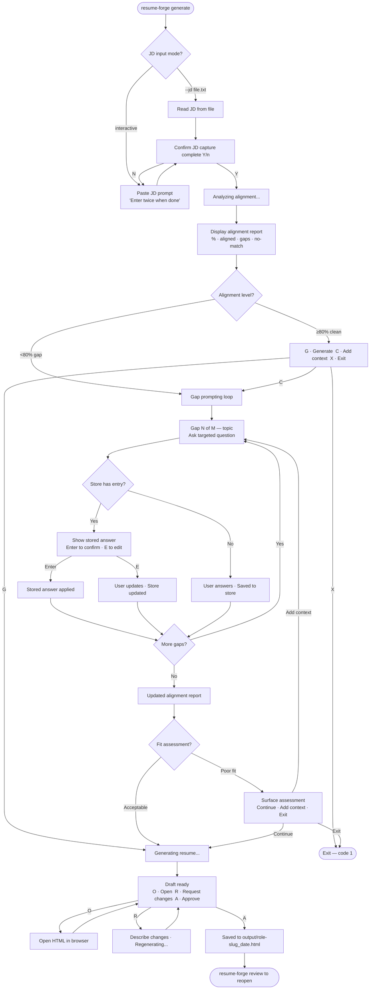
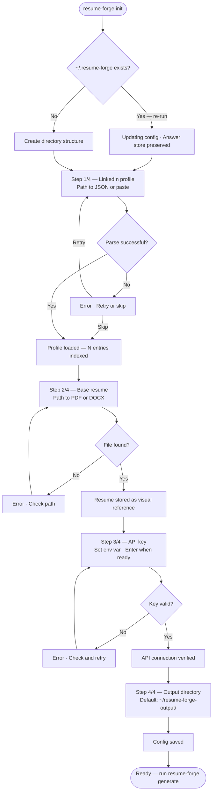
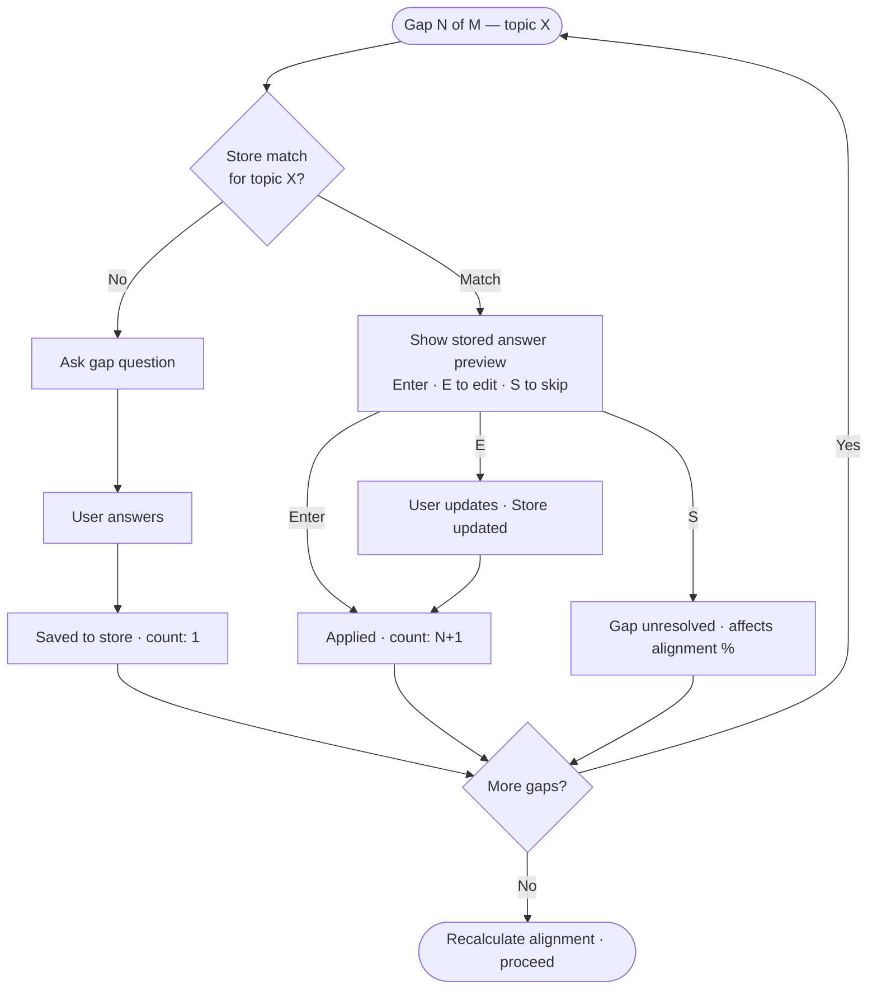

# UX Design Specification — Resume Forge

**Author:** Rainboldt
**Date:** 2026-05-28

---

<!-- UX design content will be appended sequentially through collaborative workflow steps -->

## Executive Summary

### Project Vision

Resume Forge has two UX surfaces: a CLI interaction layer (alignment reports, gap prompts, answer store confirmations, HITL review) and an HTML resume output (the rendered document, browser Print-to-PDF ready). Both surfaces carry the integrity-first promise — the CLI must feel honest and transparent, the HTML output must be indistinguishable in quality from a manually crafted resume.

### Target Users

Solo job seeker (Rainboldt), 3–5 sessions/week. Comfortable with CLI. Prioritizes control and output quality over speed. The only current user, but the architecture supports sharing with others.

### Visual Reference & Design Modifications

The reference design (Josh Rainboldt Resume.pdf) defines the template baseline with the following intentional modifications:

| Design Decision | Specification |
|---|---|
| **Layout** | Two-column — left sidebar ~27%, right main ~73% |
| **Left column purpose** | Contact info, compact skills, section anchors only |
| **Right column purpose** | Experience, achievements, summary — maximum content space |
| **Accent color** | CSS custom property `--accent-color` — default amber `#E8952A`; swappable per role or preference |
| **Color variants** | Multiple named schemes supported (amber, slate-blue, forest-green, charcoal) |
| **Section headers** | `+ SECTION NAME` pattern preserved — "+" rendered in `--accent-color` |
| **Header accent shape** | Orange geometric element (top-left) — color driven by `--accent-color` |
| **Typography** | Clean sans-serif, print-optimized sizing (~9.5–10px body) |
| **Bullets** | Large filled circles `●` |
| **Print target** | US Letter, Chrome/Edge Print-to-PDF, print media queries enforced |

### Key Design Challenges

1. **Print fidelity** — Column widths, font rendering, and page breaks must be consistent across Chrome and Edge Print-to-PDF
2. **CLI interaction quality** — Alignment report and gap prompting must feel like a thoughtful conversation; terminal formatting directly affects user trust
3. **Dynamic content in fixed template** — Variable-length LLM content must fit the two-column layout cleanly; overflow and page-break rules must be defined

### Design Opportunities

1. **Alignment report as signature CLI moment** — Color-coded percentage display with categorical breakdown makes the integrity promise visible
2. **Answer store confirmations as trust signals** — "Using stored answer for [topic] — confirm or update?" builds progressive confidence in the tool
3. **CSS variable color system** — One template, infinite identities; the color swap becomes a power-user feature that makes the tool feel personal

## Core User Experience

### Defining Experience

The core loop — the one interaction that happens 3–5 times per week and defines the product's value — is `resume-forge generate`. Everything else (init, store management, config) is one-time or maintenance. The generate loop must be the most considered, polished interaction in the entire tool.

The loop has two distinct modes that need to feel completely different:

- **Clean run (≥80% alignment):** Paste JD → see alignment report → minimal or zero prompting → review draft → approve → open HTML. Should feel nearly effortless — a confirmation more than a process.
- **Gap run (<80% alignment):** Paste JD → see alignment report → answer targeted questions → watch alignment improve → review draft → approve. Should feel like a productive conversation, not a form.

### Platform Strategy

| Surface | Platform | Input Method | Context |
|---|---|---|---|
| CLI | macOS / Windows / Linux terminal | Keyboard-only | Desktop, focused work session |
| JD input | Terminal paste or `--jd file.txt` | Clipboard / filesystem | Pre-saved from browser |
| HTML output | Chrome or Edge browser | Mouse for review, keyboard for Print-to-PDF | Same desktop session |
| PDF export | Browser native Print dialog | Mouse | Triggered immediately after review |

No mobile, no touch, no offline AI (API required). All interactions are keyboard-first.

### Effortless Interactions

These must require zero thought or friction:

- **Answer store pre-fill:** Stored answers appear automatically — user just presses Enter to confirm, not re-type
- **`resume-forge review`:** One command opens the HTML in the default browser — no file path hunting
- **`--jd file.txt`:** Saving a job posting as a text file should be the natural companion habit to using the tool; the flag makes it frictionless
- **Alignment confirmation:** When alignment is high, the tool should move quickly — one keypress to proceed, not multiple prompts
- **HITL review:** Presented as "looks good / request changes" — binary choice, not open-ended edit session

### Critical Success Moments

1. **First clean generation** — The HTML opens in the browser and looks like a polished, professional resume. This is the "it actually works" moment. Template fidelity here is non-negotiable.
2. **First honest redirect** — The tool shows 34% alignment and says "this may not be the right fit." The user agrees. Trust is established — this tool won't waste their time.
3. **First return run with pre-filled answers** — Stored answers auto-populate. The user sees "Using stored answer for [Embedded Systems] — confirm?" and just presses Enter. The tool feels *smart*.
4. **First print-to-PDF** — Chrome renders the HTML, the print dialog appears, the PDF looks exactly like the reference design. The output is sendable without a second thought.

### Experience Principles

1. **Transparency over comfort** — Show the numbers. Show the gaps. Never soften a poor-fit assessment. The alignment percentage is the product's handshake with the user.
2. **Speed through memory** — Every interaction should be faster than the last. The answer store is not a convenience feature; it is the core value proposition of repeat use.
3. **The output is the product** — The HTML resume is the moment of truth. The CLI is the path; the rendered document is the destination. Template quality is non-negotiable.
4. **Confidence through honesty** — Users should feel *more* confident sending applications because they know the tool only included what's true and defensible.
5. **Zero friction on clean runs** — When experience and role align strongly, the tool should feel nearly invisible. Minimal prompts, fast output, clean review.

## Desired Emotional Response

### Primary Emotional Goals

**Primary:** Confidence — specifically the confidence that comes from knowing what you sent is truthful, well-targeted, and defensible in an interview. Not the anxious confidence of "I hope this works," but the settled confidence of "I know why I applied to this and I can back it up."

**Secondary:** Efficiency — the quiet satisfaction of a professional tool that does its job without ceremony. Clean runs especially should feel fast and frictionless, like a well-maintained workflow rather than a product demanding attention.

**Tertiary:** Trust — in the tool itself. The kind of trust that builds with each return run: "this thing knows my professional story better than yesterday."

### Emotional Journey Mapping

| Stage | Target Emotion | Design Driver |
|---|---|---|
| **First run (init)** | Curious, slightly skeptical — "will this actually be good enough?" | Template quality on first output resolves skepticism immediately |
| **Alignment report** | Honest reckoning — "here's where I actually stand" | Transparent % + breakdown; no softening |
| **Gap prompting** | Productive discomfort → satisfaction — "I didn't know I could articulate that" | Questions that surface real experience, not fill templates |
| **Honest redirect** | Brief frustration → relief — "saved me from a wasted application" | Framing as "here's what's missing" not "you failed" |
| **Clean run** | Quiet efficiency — "that was fast and I trust it" | Minimal friction, fast output, single-keypress confirm |
| **Return run (answer store)** | Recognition — "it knows me" | Pre-filled answers showing the tool has memory |
| **After sending** | Settled confidence — "I sent something I can defend" | The output quality is the final emotional payoff |

### Micro-Emotions

| Desired | Avoided | Design Lever |
|---|---|---|
| Trust | Skepticism ("is this fabricated?") | Alignment % transparency + answer confirmations |
| Confidence | Pre-application anxiety ("will I get caught?") | Integrity-first design — only true things generate |
| Efficiency | Frustration (over-prompting) | Answer store reduces repeat questions over time |
| Pride | Embarrassment at output quality | Template fidelity is non-negotiable |
| Composure | Overwhelm at gap count | Progressive disclosure — one gap question at a time |

### Design Implications

- **Confidence → Numbers on the table.** The alignment percentage and breakdown are displayed prominently, never buried. Hiding a poor fit number would undermine the core emotional promise.
- **Trust → Atomic operations and visible memory.** Answer store writes never fail silently. Pre-filled answers are displayed before use. The tool's memory is visible, not hidden.
- **Efficiency → Keyboard-first, fast path always available.** High-overlap runs should have a one-keypress confirm at every stage. Never force the user to read more than they need to on a clean run.
- **Pride → The HTML output earns it.** Template fidelity is the last mile of the emotional journey. A broken print layout destroys the confidence built by everything before it.
- **Composure → One question at a time.** Gap prompting is sequential, not a wall of items. The user sees one gap, answers it, moves to the next. Progress is visible.

### Emotional Design Principles

1. **Never hide the truth to protect feelings** — Alignment scores, gap counts, and fit assessments are always shown clearly. The tool earns trust by being consistently honest, even when uncomfortable.
2. **Let the output speak** — The HTML resume is the emotional payoff. Every CLI interaction is preamble; the moment the browser opens is the moment the product delivers.
3. **Make memory visible** — When the tool uses stored answers, it shows you. When it learns something new, it tells you. Visible intelligence builds trust faster than invisible intelligence.
4. **One thing at a time** — In gap prompting, composure is maintained by sequential disclosure. Never present a list of failures; present one question that leads somewhere productive.
5. **Speed is respect** — On clean runs, the tool should feel like it respects your time. Unnecessary confirmations or pauses erode the confidence the tool is trying to build.

## UX Pattern Analysis & Inspiration

### Inspiring Products Analysis

**Asana — Structured Clarity**
What Asana does well: information organized into scannable, hierarchical sections with clear visual separation. Section headers are distinct, task entries follow a consistent format, and completion has a moment of acknowledgment. Status is always visible — you never wonder where you are in a workflow.

*Applied to Resume Forge:* The resume template's section structure and the CLI alignment report both follow this discipline — every section visually distinct, every entry in a consistent format, scannable in seconds.

**Slack — Conversational Precision**
What Slack does well: interactions feel like conversation, not form-filling. `/commands` are memorable and predictable. Bold draws the eye to what matters. Multi-step interactions feel organized rather than overwhelming. Prompts are short, direct, and tell you exactly what response is expected.

*Applied to Resume Forge:* Gap prompting feels like a Slack thread — one message at a time, clear context, no wall of questions. Command structure is as learnable as Slack's `/commands`. Answer confirmations are as concise as a Slack status.

**Simple, Clear CLI (first principles)**
Spinner during wait states, color-coded output, consistent prefix conventions, short prompts with explicit response expectations (`[Y/n]`, `[Enter to confirm]`).

### Transferable UX Patterns

**Terminal Output Patterns**
- **Progressive disclosure:** Alignment report as a structured block — scannable in 3 seconds, not a paragraph
- **Conversational prompts:** One gap question per message, human phrasing: "Tell me about your experience with X"
- **Visible progress:** Spinner + status line during API calls — never a blank cursor
- **Color as signal:** Amber/orange for prompts (brand-aligned), green for success, gray for informational, red for errors only

**Resume Template Patterns**
- **Consistent entry format:** `Title | Company` / `Location | Dates` / description / bullets — every entry identical structure
- **Section anchors:** `+ SECTION NAME` acts as Asana-style section headers — clear visual landing spots
- **Hierarchy through weight:** Bold for titles/companies, italic for dates/locations, regular for descriptions — three weights, no more

### Anti-Patterns to Avoid

- **Walls of terminal text** — Alignment reports and prompts must be scannable; never a paragraph where a structured block works
- **Passive or corporate prompt language** — "A gap has been identified" → "You haven't mentioned X — tell me about your experience with it"
- **Silent processing** — Any API call >1 second needs a visible indicator
- **Unnecessary confirmations on clean runs** — ≥80% alignment with full answer store coverage: show report, offer single proceed/abort
- **Resume tool fabrication patterns** — No invented metrics, no padding gaps with generic language
- **Overwhelming gap lists** — Never show all gaps at once; one at a time with visible counter ("Gap 2 of 6")

### Design Inspiration Strategy

**Adopt directly:**
- Asana-style section hierarchy for CLI alignment report and HTML resume template
- Slack-style conversational prompt phrasing for all gap questions
- CLI color-coding: amber for prompts, green for success/approval, gray for status info

**Adapt:**
- Slack's threading model → sequential gap prompting with visible counter ("Gap 2 of 6 — alignment currently 61%")
- Asana's task completion acknowledgment → "Resume saved to [path]" with clear next-step guidance

**Avoid entirely:**
- Any resume tool pattern that softens, pads, or fabricates
- Form-like prompt structures — keep it conversational throughout

## Design System Foundation

### Design System Choice

**Custom purpose-built system** — two lightweight, dependency-minimal components, one per UX surface. No web UI framework applies to a CLI tool with HTML document output.

### Rationale for Selection

- Resume Forge has no interactive UI components requiring a component library
- HTML output is a print document — CSS custom properties outperform any framework for this use case
- CLI output is terminal text — color/formatting conventions outperform any framework here
- Solo developer: zero framework overhead = faster iteration and zero dependency drift
- Full control over every visual detail matches the template-fidelity requirement

### Implementation Approach

**HTML Template — CSS Custom Properties**

```css
:root {
  /* Swappable color schemes */
  --accent-color: #E8952A;    /* amber (default) */
  --accent-dark:  #C4771A;    /* darker accent for hover/borders */
  --text-primary: #1A1A1A;
  --text-secondary: #666666;
  --text-italic:  #444444;
  --bg-primary:   #FFFFFF;

  /* Layout */
  --col-left:  27%;
  --col-right: 73%;
  --page-margin: 0.75in;
  --section-gap: 14px;
}
```

Named color schemes (switchable via CLI flag or config):
- `amber` (default) — `#E8952A`
- `slate-blue` — `#3B5F8A`
- `forest` — `#2E6B47`
- `charcoal` — `#3D3D3D`

**CLI Terminal Output — Convention System**

| Prefix | Color | Usage |
|---|---|---|
| `✦` | Amber (`--accent-color`) | Prompts, questions, gap queries |
| `✓` | Green | Success, confirmations, saves |
| `→` | Gray | Status info, progress updates |
| `✗` | Red | Errors only |
| `⠋` spinner | Gray | API wait states (via `ora`) |

### Customization Strategy

- New color schemes added to a `themes` config section — one line per theme
- Column ratio (`--col-left` / `--col-right`) adjustable via config without touching template HTML
- Font family swappable via single CSS variable (`--font-family`)
- Print margins controlled via `@page` rule in print media query — not inline styles
- All CLI output routed through a single `display.js` / `display.py` module — colors and prefixes defined once, used everywhere

## 2. Core User Experience

### 2.1 Defining Experience

**"Paste a job description, see exactly how well you fit, and get a resume that proves it."**

The defining interaction is `resume-forge generate` — from JD input to a reviewed, browser-ready HTML resume. Every other command (init, store, review, config) is setup or maintenance. This loop, run 3–5 times per week, is the product.

If we get one thing perfectly right, it's the moment the alignment report appears — clean, scannable, honest — followed by the HTML opening in the browser looking exactly like a professional resume.

### 2.2 User Mental Model

**Current approach:** Manual copy-paste from an existing resume, edit to match JD keywords, 30–45 minutes per application. The user already understands *what* needs to happen — Resume Forge does the tailoring work while they validate.

**Mental model:** "I need to customize my resume for this specific role." The tool meets this model exactly.

**Confusion points resolved:**
- "Is the output actually any good?" → HITL review; they see and approve the draft before it's final
- "Is it making things up?" → Alignment transparency and gap prompting — they provided every fact in the output
- "Did it store that answer?" → Visible confirmation when answers are saved

### 2.3 Success Criteria

The core generate interaction succeeds when:
- Alignment report is understood in under 5 seconds — no re-reading required
- Gap prompts feel like natural questions, not a numbered form
- HTML output opens in browser and looks exactly right — no formatting issues, no layout drift
- The whole run took less time than the manual alternative
- After approval, the user feels confident enough to send without second-guessing

### 2.4 Novel UX Patterns

| Interaction | Pattern Type | Approach |
|---|---|---|
| `resume-forge generate` command | Established (CLI command) | Standard — learnable immediately |
| JD paste input | Established (terminal paste) | Standard with confirmation step |
| Alignment report display | **Novel** | Structured terminal block — designed from scratch |
| Gap prompting as conversation | **Novel** | Sequential CLI prompts with visible progress counter |
| Answer store pre-fill confirmation | **Novel** | "Using stored answer — [Enter] to confirm, [E] to edit" |
| HTML output → browser review | Established (open file) | Standard — instant familiarity |

### 2.5 Experience Mechanics

**Full `resume-forge generate` loop:**

**1. Initiation**
```
$ resume-forge generate
$ resume-forge generate --jd senior-engineer-acme.txt
```

**2. JD Capture (paste mode)**
```
✦  Paste job description below. Press Enter twice when done.

> [user pastes JD text]
>
→  Captured 847 words. Does this look complete? [Y/n]
```

**3. Analysis**
```
⠋  Analyzing alignment with your experience profile...
```

**4. Alignment Report**
```
─────────────────────────────────────────
  ALIGNMENT REPORT — Senior Engineer, Acme
─────────────────────────────────────────
  Overall fit:  ████████░░  84%

  ✓ Aligned    distributed systems, API design, Go, team leadership
  ✦ Gaps       Kubernetes orchestration, incident command experience
  ✗ No match   (none)
─────────────────────────────────────────
  [G] Generate  [C] Add context  [X] Exit
```

**5. Gap Prompting**
```
✦  Gap 1 of 2 — Kubernetes orchestration

   Your profile doesn't mention Kubernetes experience.
   Tell me about any container orchestration work you've done.

>  [user answers]

→  Answer saved to store (topic: container-orchestration)
   Alignment updated: 84% → 91%
```

**6. Generation**
```
⠋  Generating resume for Senior Engineer, Acme...
```

**7. HITL Review**
```
✓  Draft ready.

   [O] Open in browser    [R] Request changes    [A] Approve & save
```

**8. Save & Next Step**
```
✓  Resume saved → ~/resume-forge-output/senior-engineer-acme-2026-05-28.html

→  Run `resume-forge review` to reopen at any time.
```

## Visual Design Foundation

### Color System

**Semantic Color Mapping**

| Token | Value | Usage |
|---|---|---|
| `--accent-color` | `#E8952A` | Section header "+" prefix, geometric accent shape, contact icons, CLI prompts |
| `--accent-dark` | `#C4771A` | Accent borders, print-safe darker accent |
| `--text-primary` | `#1A1A1A` | Body text, section headers, job titles, company names |
| `--text-secondary` | `#555555` | Dates, locations, proficiency labels |
| `--text-italic` | `#444444` | Italic date/location lines in experience entries |
| `--bg-primary` | `#FFFFFF` | Page background |
| `--divider` | `#E0E0E0` | Subtle column separator |

**Named Color Schemes**

| Theme | `--accent-color` | `--accent-dark` | Character |
|---|---|---|---|
| `amber` *(default)* | `#E8952A` | `#C4771A` | Warm, energetic — matches original resume |
| `slate-blue` | `#3B5F8A` | `#2C4A6E` | Calm, technical, corporate |
| `forest` | `#2E6B47` | `#1F4F33` | Grounded, trustworthy |
| `charcoal` | `#3D3D3D` | `#222222` | Minimal, elegant, neutral |

All themes use identical `--text-primary` and `--bg-primary` — only the accent changes.

### Typography System

**Font Family**
- Primary: **Inter** (Google Fonts) — humanist sans-serif, excellent small-size legibility and print quality
- Fallback: `'Inter', 'Calibri', 'Segoe UI', system-ui, sans-serif`

**Type Scale — Resume Template**

| Element | Size | Weight | Style | Color Token |
|---|---|---|---|---|
| Name (h1) | 28px | 700 | Normal | `--text-primary` |
| Title subtitle | 13px | 400 | Normal | `--text-secondary` |
| Section header label | 11px | 700 | Uppercase | `--text-primary` |
| Section header "+" | 11px | 700 | Normal | `--accent-color` |
| Company / Job title | 11px | 700 | Normal | `--text-primary` |
| Location / Date | 10px | 400 | Italic | `--text-italic` |
| Body / Description | 10px | 400 | Normal | `--text-primary` |
| Bullet text | 10px | 400 | Normal | `--text-primary` |
| Proficiency category | 10px | 700 | Normal | `--text-primary` |
| Proficiency items | 9.5px | 400 | Normal | `--text-secondary` |

**Line Heights:** Body `1.45` · Section headers `1.2` · Name `1.1`

### Spacing & Layout Foundation

**Page Layout**
```
Page size:    US Letter (8.5" × 11")
Margins:      0.75in all sides (print media query)
Columns:      left 27% | right 73%
Column gap:   20px
```

**Spacing Scale (base 4px)**

| Token | Value | Usage |
|---|---|---|
| `--space-xs` | 4px | Bullet indent, icon-text gap |
| `--space-sm` | 8px | Within-entry spacing (title → dates) |
| `--space-md` | 14px | Between sections |
| `--space-lg` | 20px | Column gap, header bottom margin |
| `--space-xl` | 28px | Header block bottom margin |

**Layout Rules**
- Left column: static — content never wraps mid-item
- Right column: flowing — experience entries stack naturally; `page-break-inside: avoid` per entry
- Section headers: consistent `margin-top: var(--space-md)` rhythm throughout

### Accessibility Considerations

- `--text-primary` (#1A1A1A) on white: **18.1:1** contrast (AAA)
- Accent color used decoratively only ("+", shapes, icons) — WCAG 2.1 non-text exemption applies
- Minimum body text 9.5px — renders correctly at print resolution
- `color-adjust: exact` set in print media query for accurate color reproduction

## Design Direction Decision

### Design Directions Explored

Six directions generated in `ux-design-directions-resume-forge.html`:

| Direction | Accent | Key Differentiator |
|---|---|---|
| A — Amber Reference | `#E8952A` | Faithful to original design, narrowed left column — the default |
| B — Slate Professional | `#3B5F8A` | Corporate/technical character |
| C — Forest Trust | `#2E6B47` | Grounded, reliability-forward |
| D — Charcoal Minimal | `#3D3D3D` | All-neutral, no color accent |
| E — Amber Compact | `#E8952A` | Tighter spacing for content-dense runs |
| F — Bold Header | `#E8952A` | Full-width amber header band, assertive entry |

All directions share the 27%/73% column ratio and Inter typography. Accent color is the primary variable.

### Chosen Direction

**Direction A — Amber Reference Modified** as the default template.

All 4 color schemes (amber, slate-blue, forest, charcoal) are implemented as swappable CSS custom property themes — any can be applied per-run via `--theme` flag. Direction E (compact) is available as a `--compact` flag option for content-heavy resumes. Direction F is available as an alternate template variant.

### Design Rationale

- Direction A preserves the visual identity of the reference resume while incorporating the narrowed left column
- The CSS variable system means the "chosen direction" is really a default, not a constraint — color swaps at generation time cost nothing
- Direction E (compact) solves the page overflow problem for long experience sections without a separate template
- Directions B, C, D, F are all production-ready alternates that can be applied by changing `--accent-color`

### Implementation Approach

- Single `resume.html` + `styles.css` template supports all color variants via CSS custom properties
- Theme applied at generation time: tool injects `<style>:root { --accent-color: #3B5F8A; }</style>` for non-default themes
- Compact mode: adds `class="compact"` to `.resume` element — a single CSS class that overrides spacing
- Bold header (Direction F): separate `resume-bold.html` template variant — user selects via config

## User Journey Flows

### Flow 1: Core Generate Loop

Covers Journey 1 (Clean Match), Journey 2 (Stretch Role), and Journey 3 (Honest Redirect).



### Flow 2: Init Setup Flow



### Flow 3: Answer Store Return Run



### Journey Patterns

**Navigation:** Keyboard-only · Single-letter choices at all decision points · Enter = default accept · Ctrl+C exits cleanly from any state

**Decision patterns:** Binary `[Y/n]` for confirmations · Three-way `[G/C/X]` and `[O/R/A]` at branching points · Free text for all open-ended inputs

**Feedback patterns:**
- `⠋` spinner — all async operations >0.5s
- `✓` green — success states
- `✦` amber — prompts and questions
- `→` gray — informational status
- `✗` red — errors with recovery instruction
- Gap counter "Gap N of M" — always visible
- Alignment % updates inline after each context round

### Flow Optimization Principles

1. Clean path (≥80% + full store): 3 keypresses from report to saved file (G → O → A)
2. Store confirmations default to accept — override is opt-in
3. Exit always available at every decision point — no trapped states
4. Progress always visible — gap counter, alignment %, spinner states
5. All errors are non-destructive — retry without losing state

## Component Strategy

### HTML Resume Template Components

**1. Resume Header**
- Parts: Geometric accent shape (top-left) · name (28px bold) · subtitle (pipe-separated, gray)
- Variants: `standard` (shape) · `bold-header` (full-width accent band, white name)
- CSS: `.r-header` · `.r-header-accent` · `.r-name` · `.r-subtitle`
- Print: Stays on page 1, never breaks

**2. Section Header**
- Anatomy: `+` in `--accent-color` + bold uppercase label
- CSS: `.r-sh::before { content: '+'; color: var(--accent-color); }`

**3. Experience Entry**
- Parts: Title | Company (bold) · Location | Date (italic) · Description · Bullet list
- Variants: `full` (desc + bullets) · `bullets-only`
- Print rule: `page-break-inside: avoid`
- CSS: `.r-job` · `.r-jtitle` · `.r-jmeta` · `.r-jdesc` · `.r-jbullets`

**4. Contact Block**
- Parts: Icon square (14px, accent background, white symbol) + bold text
- Items: Phone · Email · LinkedIn — rendered identically
- CSS: `.r-ci` · `.r-icon`

**5. Skill / Achievement Lists**
- Bullet: large filled circle `●` at 6–7px, same color as text
- CSS: `.r-skills li::before` · `.r-achiev li::before`

**6. Page Break Handler**
- `page-break-inside: avoid` on `.r-job`, contact block, section header groups
- Natural breaks allowed between sections

### CLI Terminal Output Components

All CLI components are functions in a single `display` module — colors and structure defined once.

**7. Alignment Report Block**
```
─────────────────────────────────────
  ALIGNMENT REPORT — Role Title, Co
─────────────────────────────────────
  Overall fit:  ████████░░  84%

  ✓ Aligned    skill-a, skill-b
  ✦ Gaps       skill-c, skill-d
  ✗ No match   (none)
─────────────────────────────────────
  [G] Generate  [C] Add context  [X] Exit
```
States: `clean` (≥80%) · `gap` (<80%) · `poor-fit`

**8. Gap Prompt** — `✦` amber + counter + topic + question + `>` input

**9. Answer Store Confirmation**
```
→  Using stored answer for 'container-orchestration'
   "Led Kubernetes migration for 3 production services..."
   [Enter] confirm · [E] edit · [S] skip
```
States: `confirmed` · `edited` (updates store) · `skipped`

**10. Progress Spinner** — `ora` / `halo` library · gray text · resolves to `✓` or `✗`

**11. Success Message** — `✓` green + detail + `→` gray next-step hint

**12. Error Message** — `✗` red + plain description + concrete recovery action (no dead ends)

### Component Implementation Strategy

- All HTML components are pure CSS classes — no JavaScript in resume template
- All CLI components are functions in one `display` module — imported everywhere
- CSS custom properties are the only configuration surface — no hardcoded values
- Print media query is a separate CSS block — never mixed with screen styles

### Implementation Roadmap

**Phase 1 — MVP:** All 6 HTML template components · Alignment Report · Gap Prompt · Answer Store Confirmation · Progress Spinner · Success + Error Messages

**Phase 2 — Growth:** Compact mode CSS (`.compact`) · Bold header variant · Color theme injection · Store list display · Run history display

## UX Consistency Patterns

### CLI Feedback Patterns

| Signal | Prefix | Color | Meaning | When to use |
|---|---|---|---|---|
| Success | `✓` | Green | Action completed | File saved, answer stored, API verified |
| Prompt | `✦` | Amber | Input required | Gap questions, confirmations, JD paste |
| Status | `→` | Gray | Neutral update | Alignment update, hints, next steps |
| Error | `✗` | Red | Action failed | API error, file not found, invalid config |
| Spinner | `⠋` | Gray | Async wait | LLM call, file write, profile indexing |

**Rules:** `✦` amber = prompts only — never reuse for status. Every `✗` error is followed by a `→` recovery instruction. `→` status lines never end a significant interaction.

### Input Collection Patterns

**Single-character choice** — `[G/C/X]`, `[O/R/A]` — no Enter, immediate keypress

**Confirm/abort** — `[Y/n]` — capital = default, Enter = yes

**Store confirmation** — `[Enter] confirm · [E] edit · [S] skip` — Enter is fastest path

**Free text** — `✦` question + `>` prompt on new line, Enter submits, no length constraint

**Multi-line paste** — two empty Enters = end of input, word count confirmed

**Path with default** — `[~/default-path/]` in brackets, Enter accepts, typed path overrides

### Wait State Patterns

- Every async operation >0s shows a spinner — no blank cursor
- Spinner text is descriptive (`Analyzing alignment...` not `Loading...`)
- Resolves to `✓` or `✗` on same line
- No intermediate progress % in MVP

### Empty & First-Run State Patterns

| State | Output |
|---|---|
| `generate` before `init` | `✗ No profile found. Run resume-forge init first.` |
| LinkedIn not loaded | `✗ LinkedIn profile not loaded. Re-run resume-forge init to add your profile.` |
| Empty answer store | No message — tool prompts for all gaps as expected; store builds naturally |
| `store list` empty | `→ Answer store is empty. Answers save automatically during resume-forge generate.` |
| `review` with no prior run | `✗ No generated resume found. Run resume-forge generate first.` |

### HTML Template Rendering Patterns

- **Content overflow:** Tool warns if output may exceed one page; suggests `--compact`; never auto-applies
- **Missing sections:** Sections with no content are omitted entirely — no empty headers, no "N/A" text
- **Content order:** Most role-relevant experience first, chronological within relevance tier
- **Pipe separators:** Always `Title | Company` and `Location | Date` with space-pipe-space ` | `

## Responsive Design & Accessibility

### Responsive Strategy

**CLI surface:** Fixed terminal (80-column minimum). No adaptation — terminal width is user-controlled.

**HTML resume output:** Fixed-width print document (816px = 8.5in). Does not reflow. No breakpoints, no fluid layout, no viewport-relative units. Screen preview in browser for review; Print-to-PDF for finalization.

No mobile, tablet, or touch surface. Explicitly out of scope.

### Breakpoint Strategy

Not applicable. Single exception: `@media print` switches from screen rendering to print rendering:

```css
@media print {
  @page { size: letter; margin: 0.75in; }
  .resume { width: 100%; }
  * { -webkit-print-color-adjust: exact; color-adjust: exact; }
}
```

This is the only layout transition in the template and must be correct for the product to work.

### Accessibility Strategy

**WCAG target:** Level AA — also benefits ATS (Applicant Tracking System) keyword parsing.

**CLI:** All signals use color + symbol prefix — no color-only communication. Compatible with terminal screen readers. Keyboard-only by nature.

**HTML resume:**
- Semantic HTML: `<h1>` for name · `<h2>` for section headers · `<ul>/<li>` for all lists
- Contrast: `--text-primary` (#1A1A1A) on white = 18.1:1 (AAA)
- Accent used decoratively only — WCAG non-text exemption
- `lang="en"` on `<html>` · `<meta charset="UTF-8">`
- No table layout — CSS grid/flexbox only

### Testing Strategy

**Print fidelity (critical):** Chrome + Edge on Windows → Print → Save as PDF. Verify column widths, font rendering, page breaks between entries, accent color accuracy.

**CLI:** macOS Terminal + Windows Terminal. Verify 80-column fit, color output, `NO_COLOR=1` fallback (symbols still readable without color).

No device testing, no screen reader testing, no mobile testing required.

### Implementation Guidelines

**HTML template:** `rem` for font sizes (root = 10px) · CSS grid for columns · spacing via tokens · print media query as separate block at bottom of `styles.css`

**CLI display module:** All output through `display` module — never raw `console.log` · check `NO_COLOR` env var · limit lines to 78 characters · all spinners have deterministic completion
